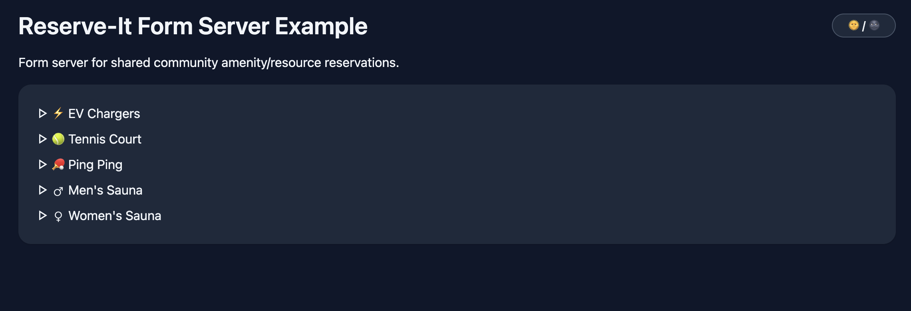

# reserve-it!

[](https://github.com/joshhubert-dsp/reserve-it/actions/workflows/test.yml)

A dead-simple reservation system framework, built on Google Calendar and Pydantic.

`reserve-it` is a lightweight framework that enables rapidly building a web server for shared community amenity/resource reservations.
It provides a customizable validation logic layer around creating events in a restricted but publicly
viewable Google calendar. Users don't need to make an account, the base configuration
only requires an email address. You can choose whether or not to implement a shared
password or other authentication in the web form, see below.


If you have multiple resources to reserve, it automatically makse the root endpoint a
home page for navigating between them:


## Basic Setup

All it takes to build a resource reservation system website for your organization/community:

1. Make a dedicated Google account for your organization, and a Google calendar for each
   reservable resource.

2. Create a folder of yaml files, one for each set of resources, like this:

```yaml
resource_name: Tennis Courts
emoji: 🎾
description: Love is nothing.
# the google calendars for each individual tennis court
calendars:
    { CourtA: { id: longhexstring1@group.calendar.google.com, color: "#AA0000" } }
    { CourtB: { id: longhexstring2@group.calendar.google.com, color: "#00AA00" } }
    { CourtC: { id: longhexstring3@group.calendar.google.com, color: "#0000AA" } }

day_start_time: 8:00 AM
day_end_time: 8:00 PM
# the granularity of available reservations, here it's every hour from 8 to 8.
minutes_increment: 60
# the maximum allowed reservation length
maximum_minutes: 180
# users can choose whether to receive an email reminder
minutes_before_reminder: 60
# how far in advance users are allowed to make reservations
maximum_days_ahead: 14
# users can choose whether they're willing to share a resource with others
allow_shareable: true

# image displayed on form webpage
image:
  {
    path: /Users/me/reserve-it/resource-config-examples/courts.jpg,
    caption: court map,
    pixel_width: 800,
  }

```

3. Write a simple python script to define custom form inputs, validation, and resource
   paths, and build the app:

```python
import os
from pathlib import Path
from typing import Self

import uvicorn
from pydantic import model_validator

from reserve_it import CustomFormField, ReservationRequest, build_app


# This defines a password form field that is added to all resource reservation webpages
PASSWORD_FIELD = CustomFormField(
    type="password", name="password", label="Password", required=True
)

# This subclass handles password validation
class PasswordProtectedRequest(ReservationRequest):
    password: str

    @model_validator(mode="after")
    def check_password(self) -> Self:
        if self.password != os.getenv("PASSWORD"):
            raise ValueError("Invalid input")
        return self


SRC_ROOT = Path(__file__).parents[3]


if __name__ == "__main__":
    app = build_app(
        title="Reserve-It Form Server Example",
        description="Form server for shared community amenity/resource reservations.",
        resource_config_path=SRC_ROOT / "resource-config-examples",
        sqlite_db_path=SRC_ROOT / "sqlite_dbs",
        gcal_cred_path=SRC_ROOT / "client_secret.json",
        gcal_token_path=SRC_ROOT / "auth_token.json",
        custom_form_fields=PASSWORD_FIELD,
        request_classes=PasswordProtectedRequest,
        version="0.1.0",
    )
    uvicorn.run(app, host="127.0.0.1", port=8000)

```

4. Host the app somewhere accessible to your community, and disseminate any shared
   passwords/validation information through communication channels.

## Features

-   Users don't need to make accounts or log in, an email address is the only required
    form of identification.
-   Users receive email confirmation for their reservation in the form of a Google
    calendar invite. A reservation is represented by a normal calendar event that the
    user is invited to, which they can conveniently add to their own calendar.
-   Additionally users can opt to receive a reminder email N minutes before their
    reservation.
-   One reservation can be held per email address at a time. Users can cancel their
    reservations to reschedule. A minimal sqlite database is stored on the server to
    enforce this.
-   Each independently reservable resource is backed by its own Google calendar. When a
    user submits a reservation, each included calendar is checked, and the first
    calendar still available during the selected time is automatically chosen.
-   The time granularity and other configuration for each set of related resources (ie.
    a set of tennis courts) is ergonomically defined in a single yaml file (see
    `calendars` section in the yaml example above). Each yaml file maps to a single
    reservation webpage.
-   Yaml files are stored in the directory passed to `resource_config_path`. When more
    than one yaml file is present, a home page is automatically generated for navigating
    between reservation webpages, and the filenames are used for the endpoint paths.
-   For resources that can be shared between multiple users at once (like say, a sauna),
    users can select that they are willing to share with others. If they are, subsequent
    users who are willing to share can reserve overlapping times, while users who are
    not willing to share are barred from these times like normal.
-   You may define custom form input fields and validation logic either globally or per
    reservation page via the yaml file. This data will be available for validation only,
    but not stored to the database.
-   Webpage light/dark mode toggle that respects user system settings by default.

## TODO

-   If requested, could add flexibility in persistent database storage and related validation.
